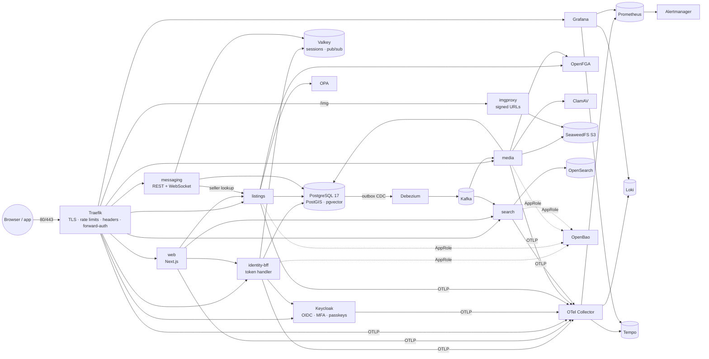

# Raadi

Raadi ("search" in Somali) is an open-source classifieds marketplace for Norway, in the spirit of Finn.no. It
has a web app, a mobile app, domain microservices and four AI pillars: governance, cybersecurity, data
management and IaC operations. All of it is 100% OSI-licensed and runs fully offline on a laptop, with
**Docker as the only prerequisite**.

## Quickstart

```bash
git clone https://github.com/Jibsta91/raadi.com.git raadi && cd raadi
docker compose up
```

When the stack is ready, the `summary` container prints every URL and the demo logins. Open
**http://raadi.localhost**.

> `*.localhost` resolves to your machine without editing the hosts file. HTTPS also works
> (`https://raadi.localhost`) with a dev CA generated inside a container; trusting it is optional
> (`./raadi ca-cert`). The first run builds images and takes a few minutes; later starts take about a minute.

## Demo users

All demo users share the password **`raadi-demo-pass`** (development only; production has no seed users).

| User                            | Role                           |
| ------------------------------- | ------------------------------ |
| `kari.nordmann@raadi.localhost` | buyer/seller (Norwegian)       |
| `ola.nordmann@raadi.localhost`  | buyer/seller (Norwegian)       |
| `amina.hassan@raadi.localhost`  | buyer/seller (English)         |
| `moderator@raadi.localhost`     | moderator (Grafana viewer)     |
| `admin@raadi.localhost`         | platform admin (Grafana admin) |

Generated infrastructure credentials are never committed. Read them with `./raadi secret <name>`, for example
`keycloak_admin_password`, `grafana_admin_password` or `openbao_root_token`.

## Architecture



The C4 context and container diagrams, the request flow and the startup graph are in
[docs/architecture/c4-container.md](docs/architecture/c4-container.md). Decisions are recorded as
[ADRs](docs/adr/README.md).

## Services and ports

Only the gateway publishes host ports (`127.0.0.1:80` and `:443` in development). Internal ports are on the
Compose network.

| Service                            | Internal port           | URL (development)                                               |
| ---------------------------------- | ----------------------- | --------------------------------------------------------------- |
| Web app (Next.js)                  | 3000                    | http://raadi.localhost                                          |
| identity-bff (NestJS)              | 4000                    | http://raadi.localhost/auth/\*, /api/v1/identity/\*             |
| listings · search · media (NestJS) | 4000 each               | /api/v1/listings · /api/v1/search · /api/v1/media               |
| messaging (NestJS)                 | 4000                    | /api/v1/messaging/\* (REST), /api/v1/messaging/ws (WebSocket)   |
| imgproxy (listing images)          | 8080                    | http://raadi.localhost/img/… (signed URLs only)                 |
| Keycloak                           | 8080, 9000              | http://auth.raadi.localhost (admin console: `/admin/`)          |
| Grafana                            | 3000                    | http://grafana.raadi.localhost (SSO as `admin@raadi.localhost`) |
| Prometheus / Alertmanager          | 9090 / 9093             | http://prometheus.raadi.localhost                               |
| Traefik dashboard                  | — (`api@internal`)      | http://traefik.raadi.localhost/dashboard/                       |
| OpenBao                            | 8200                    | http://bao.raadi.localhost/ui/                                  |
| Mailpit (all e-mail in dev)        | 1025 / 8025             | http://mail.raadi.localhost                                     |
| PostgreSQL · Valkey                | 5432 · 6379             | internal only                                                   |
| Kafka · Kafka Connect · Apicurio   | 9092 · 8083 · 8080      | internal only                                                   |
| OpenSearch · SeaweedFS · ClamAV    | 9200 · 8333 · 3310      | internal only                                                   |
| OpenFGA · OPA                      | 8080 · 8181             | internal only                                                   |
| OTel Collector · Loki · Tempo      | 4317/4318 · 3100 · 3200 | internal only (via Grafana)                                     |

The full table, including the services that later phases add, is in
[docs/architecture/c4-container.md](docs/architecture/c4-container.md#services-and-ports).

## Everyday commands

Each command is available as `./raadi <command>` or `make <command>`. Everything runs in containers.

| Command                                      | What it does                                                          |
| -------------------------------------------- | --------------------------------------------------------------------- |
| `./raadi up` / `down`                        | start (and wait until healthy) / stop                                 |
| `./raadi dev`                                | hot-reload mode: source bind-mounted, `node_modules` in named volumes |
| `./raadi lint` · `typecheck` · `test`        | quality checks in the toolbox                                         |
| `./raadi test-integration`                   | Testcontainers tests (PostgreSQL, Valkey, OpenSearch)                 |
| `./raadi smoke` · `e2e`                      | smoke test and Playwright tests against the running stack             |
| `./raadi security` · `iac-scan` · `licenses` | Trivy, Gitleaks, OSV-Scanner · Checkov · OSI license gate             |
| `./raadi toolbox`                            | shell with pnpm, uv, tofu, ansible, checkov, trivy, playwright…       |
| `./raadi secret <name>` · `ca-cert`          | read a generated secret · export the dev CA                           |

The toolbox can also be called directly: `docker compose run --rm toolbox <command>`. VS Code users can
optionally open the repository in the [Dev Container](.devcontainer/devcontainer.json).
[docs/development.md](docs/development.md) covers the development workflow.

## Switching the LLM provider

_Available from Phase 4._ AI services never call a model vendor directly. They call **LiteLLM**, an
OpenAI-compatible proxy, which routes to local **Ollama** models by default, so the platform runs offline. To
use another provider (any OpenAI-compatible API, Azure OpenAI, Anthropic, Mistral, a vLLM server and so on),
change the model routes in `deploy/litellm/config.yaml` and put the provider's API key in OpenBao. The services'
code doesn't change. AI Governance logs model, version and prompt version for every decision, so provider
switches stay auditable.

## Deploying

The same images and Compose files run on any Linux VM with Docker. Provisioning (OpenTofu), the Deploy
workflow, Let's Encrypt, backups and the "zero to live in 15 minutes" guide arrive in Phase 5 as
[docs/deploy.md](docs/deploy.md).

## Project status

Phases 1 (foundation) and 2 (listings, search, media, web) are complete. You can browse and search about 500
demo listings (full text, facets, geo radius), and sign in to create, edit, sell and delete listings with
virus-scanned images. Listing changes reach search through the outbox, Debezium and Kafka. Phase 3 is under way: buyers and sellers can message each other, with live delivery over WebSockets. See the
[roadmap](docs/roadmap.md) for later phases.

## Documentation

- [Architecture (C4)](docs/architecture/c4-container.md) · [ADRs](docs/adr/README.md) ·
  [Threat model](docs/threat-model.md) · [Runbooks](docs/runbooks/README.md) ·
  [Development](docs/development.md) · [Roadmap](docs/roadmap.md)

## License

[Apache-2.0](LICENSE). All third-party components are under OSI-approved licenses
([ADR-0009](docs/adr/0009-open-source-licensing-policy.md)).
