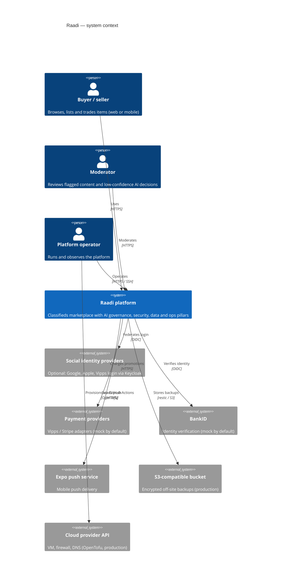
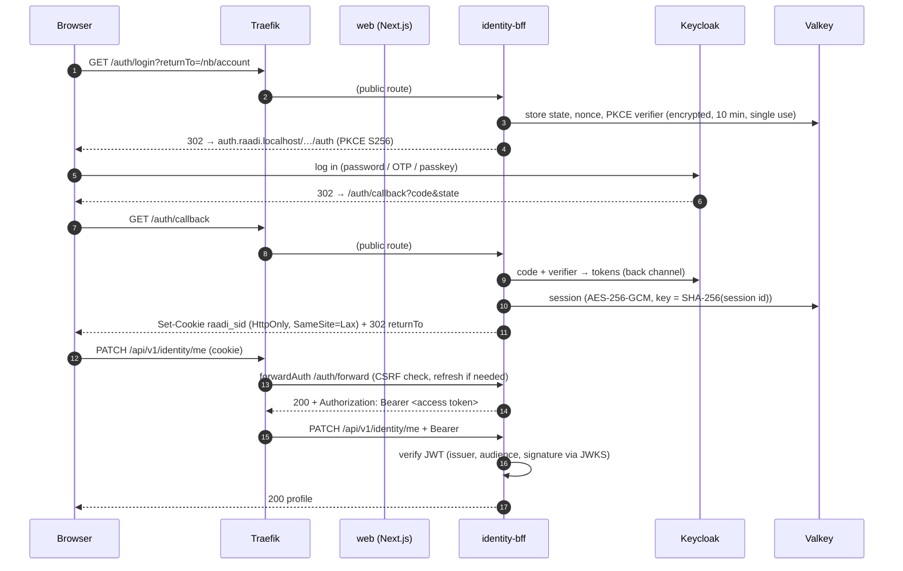
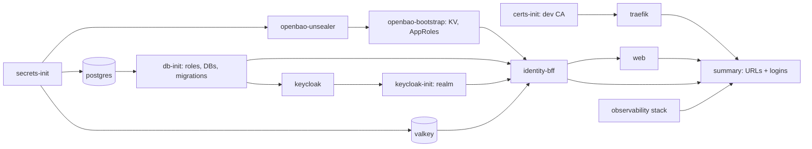

# Architecture (C4)

Raadi is a classifieds marketplace built from independently deployable containers that all run under a single
Docker Compose project, both on a laptop and on a cloud VM. This page covers the **system context** and the
**container** level of the C4 model. Containers marked _(Pn)_ arrive in phase _n_ of the [roadmap](../roadmap.md);
everything else runs today.

## Level 1 — System context

## Level 2 — Containers

```mermaid
C4Container
  title Raadi — containers
  Person(user, "Buyer / seller")
  Person(ops, "Operator / moderator")

  System_Boundary(edge, "Edge") {
    Container(traefik, "Traefik", "Go", "TLS, routing, rate limits, security headers, forward-auth; CrowdSec bouncer + Coraza WAF (P6)")
  }

  System_Boundary(clients, "Clients") {
    Container(web, "web", "Next.js 16, React 19", "SSR web app, i18n nb/en/so")
    Container(mobile, "mobile", "Expo / React Native", "iOS, Android, web (P3)")
  }

  System_Boundary(domain, "Domain services (NestJS)") {
    Container(bff, "identity-bff", "NestJS", "OIDC login, encrypted sessions, token handler")
    Container(listings, "listings", "NestJS", "Listings, categories, drafts, pricing (P2)")
    Container(search, "search", "NestJS", "Indexing, full-text/geo/semantic search, saved searches (P2)")
    Container(media, "media", "NestJS", "Signed uploads, ClamAV, EXIF strip, moderation (P2)")
    Container(messaging, "messaging", "NestJS", "Buyer-seller chat over WebSockets (P3)")
    Container(notifications, "notifications", "NestJS", "E-mail, Expo push, in-app (P3)")
    Container(payments, "payments", "NestJS", "Promoted listings, pluggable providers (P3)")
    Container(trust, "reviews-trust", "NestJS", "Ratings, BankID-ready verification (P3)")
  }

  System_Boundary(ai, "AI pillars (Python / FastAPI)") {
    Container(gov, "ai-governance", "FastAPI", "OPA policies, audit log, Presidio, GDPR, model registry (P4)")
    Container(sec, "ai-cybersecurity", "FastAPI", "Fraud/scam/ATO detection, SOC assistant (P4)")
    Container(data, "ai-data-management", "FastAPI + Dagster", "CDC lakehouse, quality, enrichment (P4)")
    Container(iacops, "ai-iac-ops", "FastAPI", "Plan review, sizing, drift, backup checks (P4)")
    Container(llm, "LiteLLM + Ollama", "OpenAI-compatible API", "Local LLM + embeddings (P4)")
  }

  System_Boundary(platform, "Platform") {
    Container(keycloak, "Keycloak", "Java", "OIDC, MFA, passkeys, brute-force protection")
    ContainerDb(pg, "PostgreSQL 17", "PostGIS + pgvector", "One database and role per service")
    ContainerDb(valkey, "Valkey", "Key-value", "Sessions, rate limits, cache")
    Container(bao, "OpenBao", "Secrets", "KV v2 + AppRole per service")
    ContainerQueue(kafka, "Kafka (KRaft)", "Apicurio, Debezium", "Domain events, CDC outbox (P2)")
    ContainerDb(os, "OpenSearch", "Search", "Full-text, facets, geo, vectors (P2)")
    ContainerDb(s3, "SeaweedFS + imgproxy", "S3", "Images and lakehouse (P2)")
    Container(fga, "OpenFGA + OPA", "Authorization", "ReBAC + policy decisions (P2)")
  }

  System_Boundary(obs, "Observability") {
    Container(otel, "OTel Collector", "OTLP", "Traces, metrics, logs hub")
    ContainerDb(prom, "Prometheus + Alertmanager", "TSDB", "Metrics and alerts")
    ContainerDb(loki, "Loki", "Logs", "Structured logs")
    ContainerDb(tempo, "Tempo", "Traces", "Distributed traces + service graph")
    Container(grafana, "Grafana", "Dashboards", "SSO via Keycloak")
  }

  Rel(user, traefik, "HTTPS")
  Rel(ops, traefik, "HTTPS")
  Rel(traefik, web, "HTTP")
  Rel(traefik, bff, "/auth/*, /api/v1/identity, forwardAuth")
  Rel(traefik, listings, "/api/v1/listings (P2)")
  Rel(traefik, keycloak, "auth.<domain>")
  Rel(traefik, grafana, "grafana.<domain>")
  Rel(web, bff, "Session + token exchange")
  Rel(bff, keycloak, "OIDC back channel")
  Rel(bff, valkey, "Sessions")
  Rel(bff, pg, "Profiles + outbox")
  Rel(bff, bao, "AppRole login")
  Rel(listings, kafka, "Outbox via Debezium (P2)")
  Rel(search, os, "Index / query (P2)")
  Rel(sec, llm, "Classify (P4)")
  Rel(bff, otel, "OTLP")
  Rel(otel, prom, "Metrics")
  Rel(otel, loki, "Logs")
  Rel(otel, tempo, "Traces")
```

## Request flow (Phase 1)

Browsers never see tokens. Mobile apps send their own bearer token, which `forwardAuth` passes through
unchanged. Every service validates the JWT itself (zero trust between services), and the gateway's
`forwardAuth` is never the only check.

## Services and ports

Only Traefik publishes ports on the host (80/443, bound to `127.0.0.1` in development). Everything else is
reachable only on the internal Docker network.

| Service                                | Phase                | Internal port                         | Public URL (development)                                           |
| -------------------------------------- | -------------------- | ------------------------------------- | ------------------------------------------------------------------ |
| traefik                                | 1                    | 80, 443, 8082 (metrics)               | `http(s)://*.raadi.localhost`, dashboard `traefik.raadi.localhost` |
| web                                    | 1                    | 3000                                  | `http://raadi.localhost`                                           |
| identity-bff                           | 1                    | 4000                                  | `http://raadi.localhost/auth/*`, `/api/v1/identity/*`              |
| keycloak                               | 1                    | 8080 (HTTP), 9000 (health/metrics)    | `http://auth.raadi.localhost`                                      |
| postgres (PostGIS + pgvector)          | 1                    | 5432                                  | —                                                                  |
| valkey                                 | 1                    | 6379                                  | —                                                                  |
| openbao                                | 1                    | 8200                                  | `http://bao.raadi.localhost` (dev)                                 |
| mailpit                                | 1                    | 1025 (SMTP), 8025 (UI)                | `http://mail.raadi.localhost` (dev)                                |
| otel-collector                         | 1                    | 4317 (gRPC), 4318 (HTTP), 8888, 13133 | —                                                                  |
| prometheus                             | 1                    | 9090                                  | `http://prometheus.raadi.localhost` (dev)                          |
| alertmanager                           | 1                    | 9093                                  | —                                                                  |
| loki                                   | 1                    | 3100                                  | — (via Grafana)                                                    |
| tempo                                  | 1                    | 3200, 4317                            | — (via Grafana)                                                    |
| grafana                                | 1                    | 3000                                  | `http://grafana.raadi.localhost`                                   |
| listings                               | 2                    | 4010                                  | `/api/v1/listings`                                                 |
| search                                 | 2                    | 4020                                  | `/api/v1/search`                                                   |
| media                                  | 2                    | 4040                                  | `/api/v1/media`                                                    |
| kafka / apicurio / debezium            | 2                    | 9092 / 8080 / 8083                    | —                                                                  |
| opensearch                             | 2                    | 9200                                  | —                                                                  |
| seaweedfs (S3) / imgproxy              | 2                    | 8333 / 8080                           | `img.raadi.localhost`                                              |
| openfga / opa                          | 2                    | 8080 / 8181                           | —                                                                  |
| clamav                                 | 2                    | 3310                                  | —                                                                  |
| messaging                              | 3                    | 4030                                  | `/api/v1/messaging`, WebSocket                                     |
| notifications                          | 3                    | 4050                                  | `/api/v1/notifications`                                            |
| payments                               | 3                    | 4060                                  | `/api/v1/payments`                                                 |
| reviews-trust                          | 3                    | 4070                                  | `/api/v1/trust`                                                    |
| mobile (Expo dev server)               | 3                    | 8081                                  | LAN / tunnel                                                       |
| ai-governance                          | 4                    | 8100                                  | `/api/v1/ai/governance`                                            |
| ai-cybersecurity                       | 4                    | 8110                                  | `/api/v1/ai/security`                                              |
| ai-data-management (+ Dagster UI 3070) | 4                    | 8120                                  | `dagster.raadi.localhost`                                          |
| ai-iac-ops                             | 4                    | 8130                                  | `/api/v1/ai/iac`                                                   |
| ollama / litellm / langfuse / mlflow   | 4                    | 11434 / 4000 / 3000 / 5000            | `langfuse.`, `mlflow.` (dev)                                       |
| openmetadata                           | 4 (`--profile full`) | 8585                                  | `catalog.raadi.localhost`                                          |

## Startup order

Compose starts containers in dependency order: `depends_on` with `service_healthy` and
`service_completed_successfully`. Every one-shot init container is idempotent, so all of them run on every `up`:

